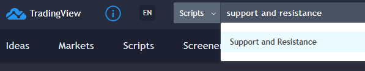

# Learning Pine Roadmap

## Introduction

This document aims to provide information that will be useful for newcomers to the [Pine Script](https://www.tradingview.com/pine-script-docs/en/v4/Introduction.html) programming language. Pine Script is the programming language used on the [TradingView](http://www.tradingview.com) charting platform.

### Table of Contents

1. [Where to go?](#where-to-go)
1. [What’s Pine?](#whats-Pine)
1. [Pine runtime environment](#pine-runtime-environment)
1. [Series](#series)
1. [New to programming?](#new-to-programming)
1. [Code examples](#code-examples)
1. [Troubleshooting Pine code](#troubleshooting-pine-code)
1. [Conversion from other platforms](#conversion-from-other-platforms)

## Where to go?

There are many resources to learn Pine. These are the most important. While you will not begin by reading the Reference Manual, it's important to know where it is. The Quickstart Guide is a good place to start and branch out to key areas of the User Manual.

1. The two primary sources of information on Pine are the [Pine v4 User Manual](https://www.tradingview.com/pine-script-docs/en/v4/index.html) and [Pine v4 Reference Manual](https://www.tradingview.com/pine-script-reference/v4/). 
Follow the instructions in the User Manual's [Quickstart Guide](https://www.tradingview.com/pine-script-docs/en/v4/Quickstart_guide.html) page to put your first script in action on a chart, and follow the links in that page to familiarize yourself with Pine's key concepts.
1. Once you start working in the Pine Editor, you can bring up the Reference Manual by Ctrl/&#8984;-clicking on any colored language keyword. From the editor, you can also view a list of keyboard shortcuts by selecting *Pine Editor Keyboard Shortcuts* from the *Help* menu. The editor's *Help* menu will link you to v4 and v3 documentation, and to forums where you can ask questions on Pine.
1. [Kodify.net](https://kodify.net/tradingview-programming-articles/) is the largest repository of Pine-related articles out there. In more than 200 articles related to Pine programming, they explore Pine features thoroughly and also present techniques for realizing common tasks in Pine.
1. PineCoders maintains a [Pine FAQ & Code](https://github.com/pinecoders/pine-utils/tree/master/guides/faq_and_code).
1. YouTube has content by Pine coders. These are a few introductory-level ones:
[How To Use Tradingview Pine Script - Introduction](https://www.youtube.com/watch?v=Kwlxngw1YBY) and its [Part 2](https://www.youtube.com/watch?v=3wW10q9QDA8). A search for `pine introduction tradingview` will turn up a few others.
1. [Backtest Rookies](https://backtest-rookies.com/category/tradingview/) also has some articles on Pine. They produce quality material illustrating many of the typical things Pine coders want to do or explore.

## What’s Pine?

Pine is a specialized language used to write scripts that can take two very different forms: **studies** (a.k.a. **indicators**, as we will name them) or backtesting **strategies**. *Indicators* are used to show graphic information on a chart or in an indicator Pane. If you wish to write a MACD indicator in Pine, you do that by creating a script using the `study()` declaration statement at the beginning of the script. **Strategies** use the `strategy()` declaration statement and can display visual information on charts or Panes in the same way an indicator would, but they also contain additional Pine statements to simulate trades in order to run backtests.

If you want to design a trading system that trades on MACD setups, you may write a *strategy* to test it, and then convert it to an *indicator* to generate alerts in order to discretionary trade on them, or send them to a third-party execution bot for relaying orders to markets. Be sure to look at the PineCoders [Backtesting and Trading Engine](https://www.tradingview.com/script/dYqL95JB-Backtesting-Trading-Engine-Pinescripters/) if this is your objective.

Because it is specialized, Pine is very powerful. You can write two lines of Pine to do what could take hundreds in other languages. The same specialization that makes Pine powerful also implies a high abstraction level; until you understand a few key concepts about Pine and its runtime environment, it will be difficult to make sense of Pine code.

There are 4 supported versions of Pine, from 1 to 4. A compiler directive used in the script's first line will tell you what version of Pine the script is written for (when no such directive is present, v1 is the default used). It is important to know which version the code you will be writing or studying is, as keywords and programming techniques can vary quite a bit between versions.

## Pine runtime environment

Pine indicator code executes once for each bar of the dataset, starting from the beginning of the chart’s history. When the realtime bar is reached, *indicator* scripts executes every time price changes, while *strategy* scripts may be configured to behave like indicators, or to run only at the close of the realtime bar (the default). See [here](https://www.tradingview.com/pine-script-docs/en/v4/language/Execution_model.html) for more information.

## Series

The main data type used in Pine scripts is called a series. It is a continuous list of values that stretches back in time from the current bar and where one value exists for each bar. While this structure may remind many of an array, a Pine series is totally different and thinking in terms of arrays will be detrimental to understanding this key Pine concept. You can read about series [here](https://www.tradingview.com/pine-script-docs/en/v4/language/Type_system.html#series) and get more information on how to use them [here](https://www.tradingview.com/pine-script-docs/en/v4/language/Operators.html#history-referencing-operator). 
 &nbsp;&nbsp;&nbsp;&nbsp;&nbsp;— quoted from the Pine v4 documentation

## New to programming?
If you are new to programming, then you have a double learning curve to go through: learn to program and learn Pine. You will need to do your homework and spend the countless hours required to become able to convert your trading ideas into working code.

Either way, the most productive way to learn is always to start playing with real code early. Start with the examples in the next section. Make slight changes to the code and see what impact they have, and you’ll be on your way.

If you already have programming experience, learning Pine is mostly about becoming proficient in manipulating series, and then understanding the abstractions, the runtime environment and the typing and runtime limitations, as the language itself is straightforward.

## Code examples

- [TradingView Pine v4 example of a simple script](https://www.tradingview.com/pine-script-docs/en/v4/Quickstart_guide.html).
- The [PineCoders open source repository](https://github.com/pinecoders/pine-utils) contains reusable code snippets and example code.
- On TradingView, PineCoders publishes [Pine examples and tools](https://www.tradingview.com/u/PineCoders/#published-scripts) and also follows [top Pine coders](https://www.tradingview.com/u/PineCoders/#following-people) who publish mostly open source code. Studying their code is one the best ways to learn.
- Kodify has an article on [Pine operators](https://kodify.net/tradingview/operators/operators-operands/) that can help you get started.
- Backtest Rookies has an article on [Writing a First Script](https://backtest-rookies.com/2017/06/07/trading-view-first-script/).
- Examples of common tasks in Pine by TV users [vtvlkv](https://www.tradingview.com/u/vitvlkv/#published-scripts) and [apozdnyakov](https://www.tradingview.com/u/apozdnyakov/#published-scripts).

## Troubleshooting Pine code

Here are a few methods for troubleshooting pine-related issues:

- The are tens of thousands of scripts published on TradingView, many with open source code. To find them, you can browse scripts on TV from [here](https://www.tradingview.com/scripts/), or search TV scripts by going to TradingView’s [main page](https://www.tradingview.com/), selecting *Scripts* in the dropdown at the left of the search field and entering what you are looking for.

- Use Google. You'll often end up on either kodify.net, backtestrookies.com, stackoverflow.com, getsatisfaction.com or the TV wiki. If you are searching for indicators on TradingView, you can use Google with: `site:tradingview.com intitle:indicatorname` for better results.
- Search [Pastebin](https://pastebin.com/) using the proper keywords and `version=X`, replacing `X` with the version of Pine you are working on.
- Plot your way out of the problem. Try simple temporary plots of data, just to see where you're at. It’s a good way to get a feel for what's going on inside the runtime loop. Use a simple `plot(var)`, or `plotchar(var, "var description", "")` to show the value in the indicator values and in the Data Window (look it up; it's real useful) without plotting anything in your indicator's space.
- Backtest Rookies has an [article on debugging techniques](https://backtest-rookies.com/2018/02/09/tradingview-pinescript-debugging-plotting-tips-tricks/).
- Ask questions in either the TradingView [Pine Script chat](https://www.tradingview.com/chat/#BfmVowG1TZkKO235), on [StackOverflow](https://stackoverflow.com/questions/tagged/pine-script) or in the [Pinescripters Telegram group](https://t.me/pinescripters). When you ask questions, take the time to state your problem concisely and clearly. The better you explain it, the more chances you have of getting an answer. The people answering questions in the different groups will not teach you Pine; you need to learn on your own as we’ve all done, but they can help you out when you are stuck.

## Conversion from other platforms

The TradingView platform does not run indicators written for other platforms. They will require conversion in Pine before they can run on TradingView charts.
